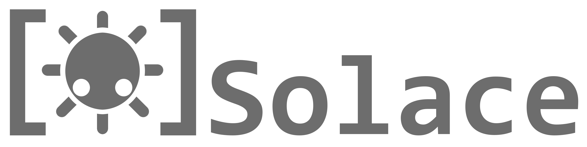

**CURRENTLY ABANDONED.** This project, while fun, is too non-specific for my other projects that would eventually have used it. I'm currently abandoning it, and my other projects will use their own specific solutions to communicate with various social media platforms. I may pick it back up later.

Multipurpose, multi-platform, modular bot microservice framework emphasizing uptime with stability, targeting .NET 5.

Please see [CONTRIBUTING.md](Tools/Information/CONTRIBUTING.md) on how to contribute. If you are contributing, you agree to the contribution guidelines.

Source code licsened under MS-PL, copyright Kameko 2019. Logos, images, text files and trademarks are owned by Kameko.
